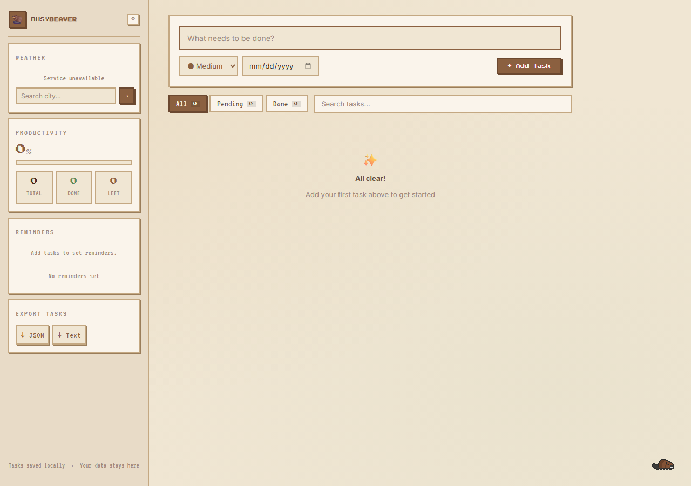

# Busy Beaver To-Do

> **CS 361 class project, redesigned.** Originally built as 4 separate Flask microservices (weather, stats, reminders, export). Refactored into a single Flask + SQLAlchemy app after the course ended, with a full pixel-art cozy redesign and an animated Oregon State beaver.



## Features

- Add, complete, and delete tasks with priority levels and due dates
- Live task filtering (All / Pending / Done) and search
- Productivity stats with progress bar
- Weather widget via OpenWeatherMap (search any city)
- Reminders with datetime and optional note
- Export tasks to JSON or plain text
- Animated pixel-art beaver mascot (reacts to task actions and randomly scurries across the screen)

## Stack

- Python, Flask, Flask-SQLAlchemy
- SQLite (local) / PostgreSQL (Render)
- Jinja2 templates, vanilla JS, CSS pixel-art theme
- OpenWeatherMap API

## Setup

```bash
pip install -r requirements.txt
```

Create a `.env` file in the project root:

```
OPENWEATHER_API_KEY=your_key_here
SECRET_KEY=any-random-string
```

Get a free OpenWeatherMap key at https://openweathermap.org/api

```bash
python app.py
```

Open http://localhost:5000

## Deploy to Render

Set these environment variables in your Render service:

| Variable | Value |
|---|---|
| `DATABASE_URL` | Render Postgres connection string (auto-set if linked) |
| `OPENWEATHER_API_KEY` | Your OpenWeatherMap key |
| `SECRET_KEY` | A random secret string |

Start command: `gunicorn app:app`

## Project Structure

```
todo_app_CS361/
├── app.py                  # Flask app, models, all routes
├── requirements.txt
├── templates/
│   └── index.html
├── static/
│   ├── css/style.css       # Pixel cozy theme
│   ├── js/app.js           # Filters, search, two-click delete
│   ├── js/beaver.js        # Sprite sheet animation
│   └── img/
│       ├── beaver_spritesheet.png
│       └── screenshot.png
└── .env                    # Not committed
```

## Developer

Samuel Dameg
